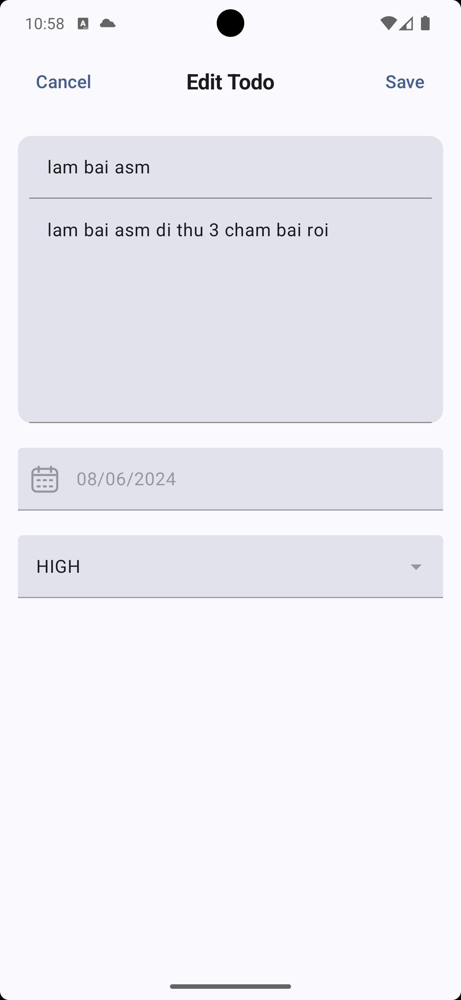

# TodoAppLab

TodoAppLab is a task management application built with Kotlin and Android Jetpack Compose.

## Features

- Main screen displaying a list of tasks.
- Option to add new tasks.
- Option to edit and delete existing tasks.
- Local storage of tasks using SQLite through Room.
- Task management including adding, editing, and deleting tasks.

## Screenshots
    

## Video Demo
Link: [Link](https://share.cleanshot.com/YdL4kCJ3)

## Technologies Used

- Kotlin: The main programming language.
- Jetpack Compose: Android's modern UI library.
- Room: Android's data access library.
- Hilt: Android's Dependency Injection library.
- Coroutines: Kotlin's library for asynchronous programming.

## Installation

Ensure you have Android Studio and JDK installed. Then, you can clone this project and open it in Android Studio.

```bash
git clone https://github.com/nqmgaming/TodoAppLab.git
```

After opening the project in Android Studio, you can run the application on your device or emulator.

## Project Structure

The project is divided into the following main packages:

- `presentation`: Contains all screens and ViewModels.
- `domain`: Contains models and use cases.
- `data`: Contains code to interact with the database.
- `core`: Contains utility classes and functions.

## Contribution

If you want to contribute to this project, please create a Pull Request. All contributions are welcome!
